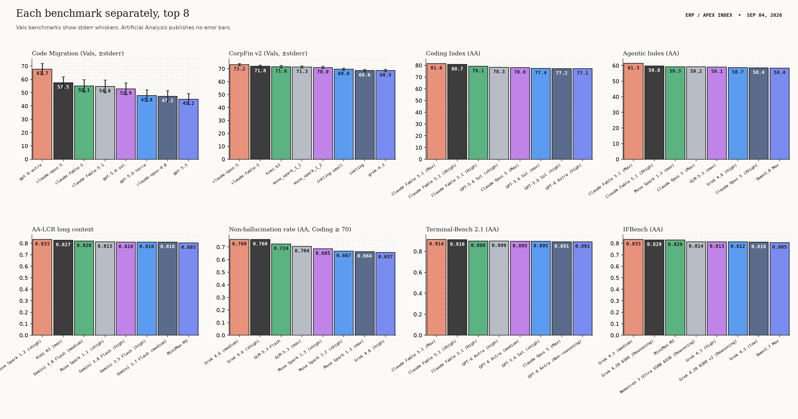
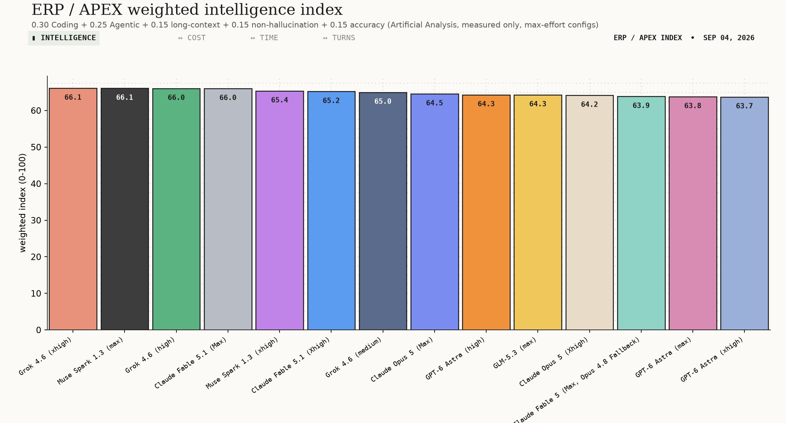
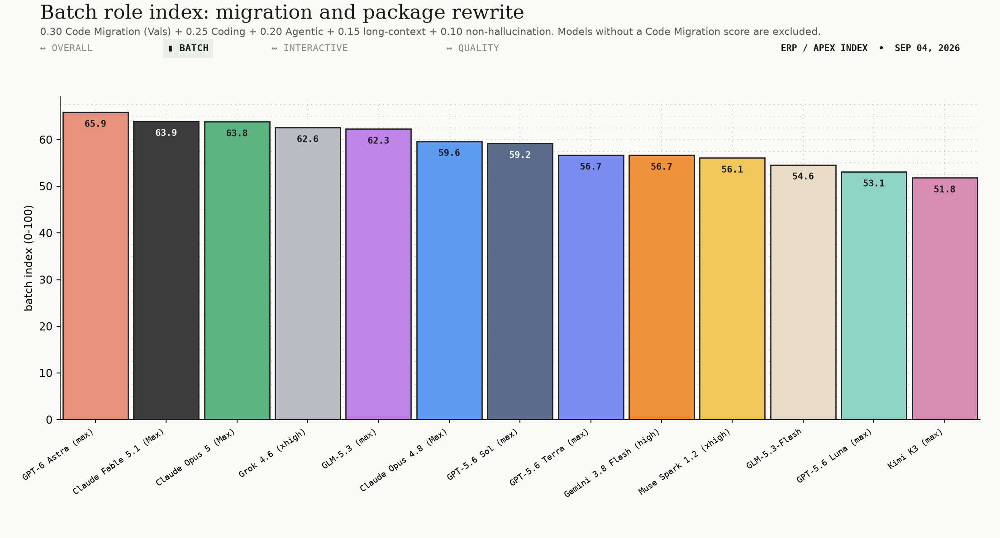
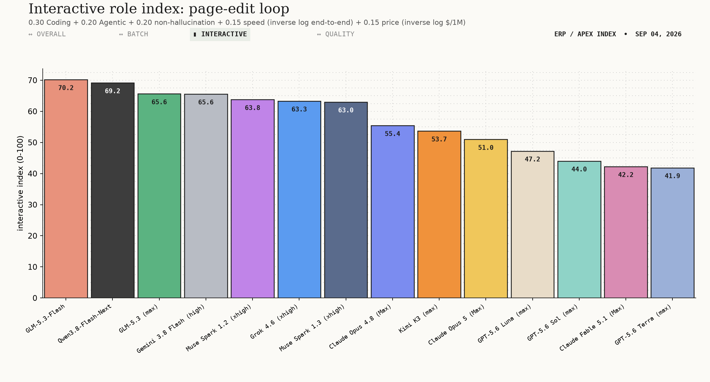
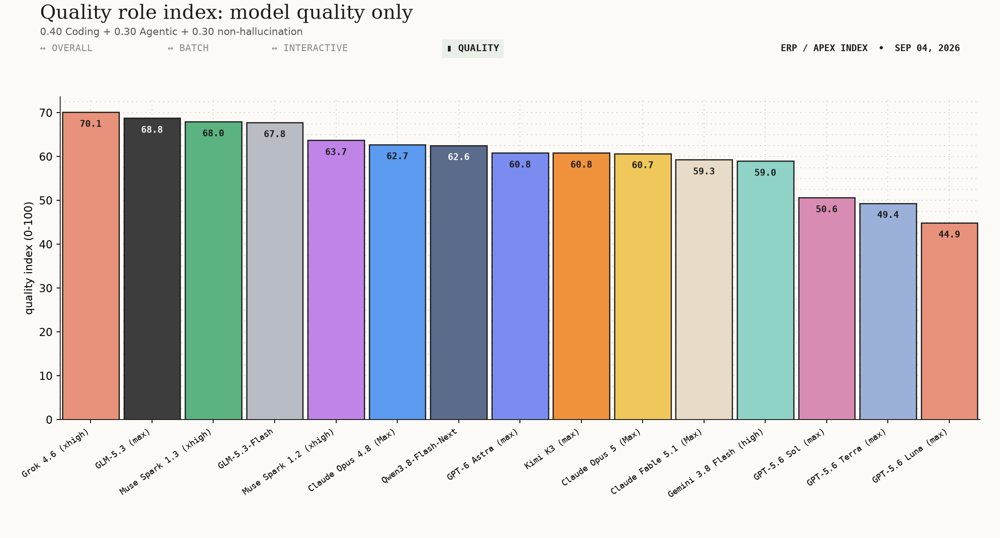
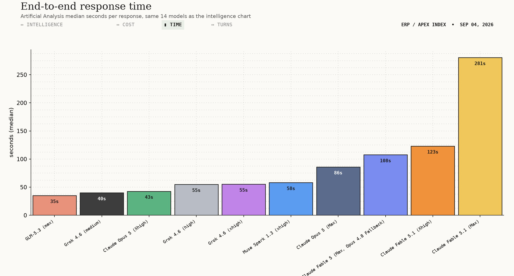
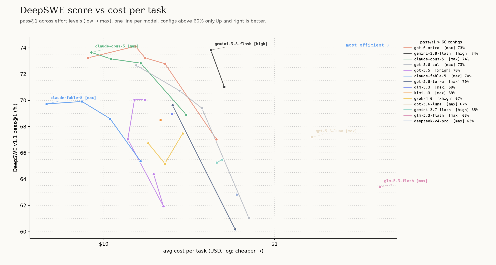
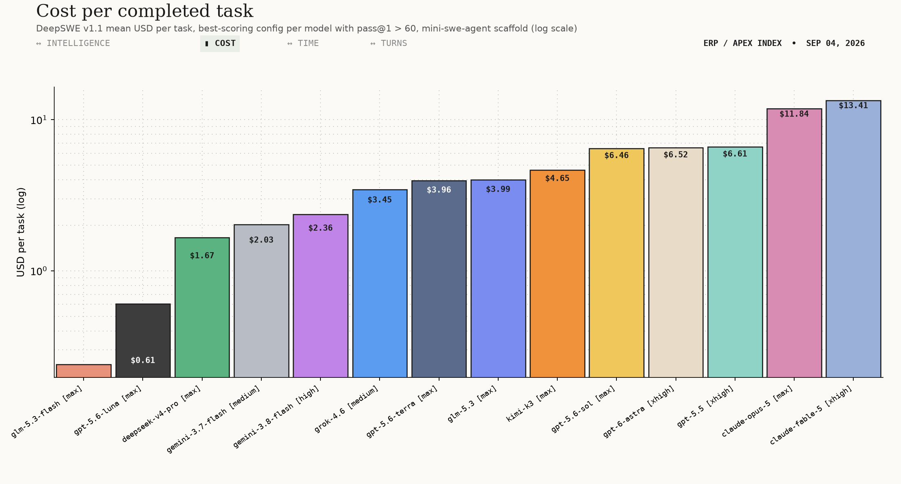
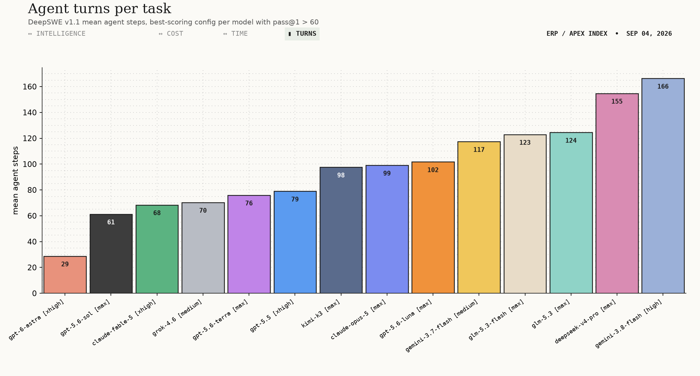

# Model shortlist for ERP and Oracle APEX development

Date: 2026-09-04. Data: `benchmark-data/20260904/`, a full re-scrape of all
ten sites (the 2026-09-02 and 2026-09-03 scrapes sit beside it for diffing).
Sources used: Vals AI, Artificial Analysis, DeepSWE v1.1, plus 30-day web and
community sweeps on Gemini 3.8 Flash and Muse Spark 1.3. Seven other scraped
sources contributed no numbers. Charts regenerate with `make_charts.py`.

Two things moved since yesterday. OpenAI's GPT-6 Astra reached the
leaderboards and took the batch role. Muse Spark 1.3 spread from two sites to
six, and its measured latency doubled.

## Best option at a glance

| Need | Pick | $/1M | Cheap alternative (under $1.50/1M) |
|---|---|---|---|
| Overall | Grok 4.6 (xhigh) | $3 | GLM-5.3-Flash, $0.24. Overall index 62.7 vs 66.1 |
| Role A: batch migration | GPT-6 Astra (max) | $20 | Gemini 3.8 Flash (high), $1.50. Batch index 56.7 vs 65.9; Code Migration 36.5 vs 67.7 |
| Role B: interactive | GLM-5.3-Flash | $0.24 | Already the cheapest model in the report |
| Role C: quality only | Grok 4.6 (xhigh) | $3 | GLM-5.3-Flash, $0.24. Quality index 67.8 vs 70.1 |

Cheap here means at most $1.50 per 1M blended tokens. The alternatives are
the highest-scoring cheap model on that row's index, and each gives up real
score, shown in the last column.

Muse Spark 1.3 is not a pick. It is third on overall (65.4) and third on
quality (68.0) at $2 per 1M, but it fell to seventh on interactive (63.0)
when its measured response time doubled overnight. It still has no batch
index because Vals and DeepSWE have not scored it. See the Muse Spark
section.

Written by Claude, an Anthropic model. Anthropic models hold two of the top
three batch-role positions but no longer the first. Non-Anthropic models win
all four indexes.

## Read first

No source tests Oracle APEX or PL/SQL. The proxies are Code Migration and
CorpFin v2 (Vals, 0-100, with stderr), Coding, Agentic, long context (AA-LCR)
and non-hallucination rate (Artificial Analysis), and DeepSWE cost per task.
The benchmark named "APEX Agents" in the data is Mercor's banking, consulting
and law agent test. It is not Oracle APEX and is excluded.

Go or no-go: the best Code Migration score is 67.7, so about a third of
migration tasks fail even for the top model. That is up from 57.5 yesterday,
on one new model. Review every migrated object.

## Which benchmark for what

| Benchmark | Measures | Stands in for |
|---|---|---|
| Code Migration (Vals) | Reimplementing real programs in another language | Legacy PL/SQL and Forms-to-APEX migration |
| CorpFin v2 (Vals) | Reasoning over long credit agreements | ERP finance logic and domain rules |
| Coding Index (AA) | General code generation | Writing PL/SQL, JavaScript, SQL |
| Agentic Index (AA) | Multi-step, tool-using tasks | Multi-file changes across a schema |
| AA-LCR (AA) | Reasoning over long inputs | Large schemas and long packages |
| Non-hallucination (AA) | Declining instead of inventing | Not fabricating `DBMS_` or `APEX_` signatures |
| Accuracy (AA) | Answering correctly | Pair with the row above; refusal alone is useless |
| End-to-end time (AA) | Seconds per full response | Page-edit turnaround |
| $/task (DeepSWE) | Cost per solved task, thinking included | Real spend per unit of work |
| $/1M (AA) | Blended token price | What the invoice says |

The HTML version has hover definitions on every term and interactive charts.

Every "first" in the Vals panels sits inside two standard errors of the
runner-up. Artificial Analysis publishes no error bars.

## Four indexes

Overall: 0.30 Coding + 0.25 Agentic + 0.15 long context + 0.15
non-hallucination + 0.15 accuracy.

Batch role (migration and package rewrite): 0.30 Code Migration + 0.25 Coding
+ 0.20 Agentic + 0.15 long context + 0.10 non-hallucination. Models with no
Code Migration score are excluded, not imputed.

Interactive role (page-edit loop): 0.30 Coding + 0.20 Agentic + 0.20
non-hallucination + 0.15 speed + 0.15 price, the last two as inverse log
min-max across the candidate set.

Quality role: 0.40 Coding + 0.30 Agentic + 0.30 non-hallucination. This is
the interactive index with the operational terms removed, so the models rank
on quality alone.

The weights are mine. Change them in `make_charts.py` and the order moves.
Frontier models at max effort take 86 to 281 s per response, too slow for a
page-edit loop, which is why roles A and B are split. Artificial Analysis
re-measures latency daily and the numbers move: Muse Spark 1.3 went from 31 s
to 58 s in one day, Grok 4.6 from 44 s to 55 s.

## Role A: batch migration and package rewrite

| Pick | Model | Batch idx | Code Migration | CorpFin v2 | Coding | Non-halluc / acc | E2E | $/1M | $/task |
|---|---|---|---|---|---|---|---|---|---|
| Primary | GPT-6 Astra (max) | 65.9 | 67.7 ±4.2 | n/a | 76.9 | 0.49 / 0.63 | n/a | $20 | $6.52 |
| Alt 1 | Claude Fable 5.1 (max) | 63.9 | 55.1 ±4.6 | 71.8 ±0.9 | 81.6 | 0.27 / 0.67 | 281 s | $20 | $13.41 |
| Alt 2 | Claude Opus 5 (max) | 63.8 | 57.5 ±4.4 | 73.2 ±0.9 | 78.0 | 0.39 / 0.61 | 86 s | $10 | $11.84 |

GPT-6 Astra took this role on 2026-09-02. Its 67.7 ±4.2 on Code Migration
beats Opus 5 by 10.2 points, the first lead in this report that clears the
combined standard error. It also tops Vals Terminal-Bench 2.1 at 87.3 and
DeepSWE v1.1 at 74.1 pass@1, and it solves those tasks in 29 agent steps
where Opus 5 needs 99. Use high effort as the default: 73.2 pass@1 at $5.72
per task, against 74.1 at $6.52 for xhigh.

Three gaps come with it. Vals has no CorpFin v2 row for Astra, so the ERP
finance proxy is untested. Artificial Analysis publishes no latency row, so
it cannot enter the interactive index. Its 0.49 non-hallucination rate is
mid-table, well behind Grok 4.6 at 0.76, so it invents a signature about half
the time it does not know one. It also costs $20 per 1M.

Opus 5 remains the pick when the finance side matters: it leads CorpFin v2 at
73.2 ±0.9, answers in 86 s, and costs half as much per token. Fable 5.1 is
for the hardest generation work where the 81.6 coding score matters and a
four-minute wait does not. Grok 4.6 (62.6) is the cheap alternative at $3,
with the best non-hallucination rate above coding 70, but its 44.6 on Code
Migration is 23 points behind Astra, so it is not the migration engine.

GPT-5.6 Sol (max) sits sixth at 59.2, statistically tied with Opus 5 on Code
Migration (52.9 ±4.4), with the best published IFBench score (0.727). Its 0.08
non-hallucination rate rules it out here: it invents a package signature about
9 times in 10 when it does not know one. Kimi K3 stays out of this role on
16.1 for Code Migration.

Per-token price is flat across effort levels; score and cost per task are not.
Fable 5.1's coding lead is a config effect (high effort scores 79.1 at the same
$20), and on DeepSWE Opus 5 beats Fable 5 at half the cost per task. Terra is
effort-fragile: coding drops from 76.7 at max to 67.1 at high.

## Role B: interactive APEX work

| Pick | Model | Interactive idx | Coding | Agentic | Non-halluc / acc | TTFT | E2E | $/1M | $/task |
|---|---|---|---|---|---|---|---|---|---|
| Primary | GLM-5.3-Flash | 70.2 | 71.5 | 58.2 | 0.72 / 0.28 | 1.7 s | 54 s | $0.24 | $0.24 |
| Alt 1 | Qwen3.8-Flash-Next | 69.2 | 73.1 | 56.4 | 0.55 / 0.24 | 2.8 s | 33 s | $0.23 | n/a |
| Alt 2 | GLM-5.3 (max) | 65.6 | 74.8 | 59.1 | 0.70 / 0.34 | 1.9 s | 35 s | $2.15 | $3.99 |

GLM-5.3-Flash leads on the index and is the cheapest model with an agentic
score above Sol. Its 0.72 non-hallucination pairs with 0.28 accuracy: it
abstains rather than knows. Qwen3.8-Flash-Next is 1.0 behind, has 256K
context and no DeepSWE row. GLM-5.3 (max) is the third alternative and the
one with real weight: the highest agentic score in this table, 35 s end to
end, $3.99 per task, and it is hosted in China.

Gemini 3.8 Flash (high) is fourth at 65.6, one hundredth behind GLM-5.3, and
is the alternative with the strongest DeepSWE row: 73.8 pass@1 at $2.36 per
task and 12 s end to end, the fastest response in the report.

Muse Spark 1.3 left this table. It ranked third yesterday at 66.9, but
Artificial Analysis re-measured it at 58 s end to end against 31 s the day
before, and 150 output tokens per second against 235. That drops it to
seventh at 63.0. If the latency was a launch-week artefact it will come back;
today the number is what it is.

GPT-5.6 Luna stays out of this role. It is cheap per solved task (67.2 pass@1
at $0.61), but it is not interactive at max (176 s) and its 0.07
non-hallucination rate is the worst in the table.

## Role C: quality only

| Pick | Model | Quality idx | Coding | Agentic | Non-halluc / acc |
|---|---|---|---|---|---|
| Primary | Grok 4.6 (xhigh) | 70.1 | 75.9 | 56.6 | 0.76 / 0.43 |
| Alt 1 | GLM-5.3 (max) | 68.8 | 74.8 | 59.1 | 0.70 / 0.34 |
| Alt 2 | Muse Spark 1.3 (xhigh) | 68.0 | 76.5 | 56.1 | 0.69 / 0.42 |

The three leaders sit within 2.1 points. Grok 4.6 has the best non-hallucination
rate of any model with a coding index above 70. GLM-5.3 (max) has the highest
agentic score in the table and is hosted in China. Muse Spark 1.3 (xhigh)
has the highest coding index of the three, no DeepSWE row, and a community
record on 1.2 that reports reward hacking in agent loops.

GLM-5.3-Flash is fourth at 67.8, 2.3 behind Grok, and is the cheap
alternative in the glance table. The frontier models rank low here because
of hallucination, not coding: GPT-6 Astra scores 60.8, Opus 5 60.7 and Fable
5.1 59.3, with three of the four highest coding indexes in the report and
non-hallucination rates of 0.49, 0.39 and 0.27. GPT-5.6 Sol is 50.6 at 0.08.
This index is the one that separates a model that says "I do not know" from
one that writes a plausible `APEX_` call that does not exist.

## Gemini 3.8 Flash, what the web says today

Google shipped it on 2026-09-02, three weeks after 3.7 Flash. The "beats
Opus" line comes from Google engineers' side-by-side preference on an internal
platform, reported by the WSJ; it is not a public head-to-head. Public
benchmarks are mixed: Terminal-Bench 2.1 rose to 90.8 from 81.6, DeepSWE to
71 from 65.3, while SWE-Bench Pro moved one point and HLE stayed flat. The
$0.75 / $3.75 per 1M price is promotional through 2026-12-31 and doubles to
$1.50 / $7.50 on 2027-01-01; budget on the standard rate. Day-one API users
reported hours of "high demand" errors. Reddit splits on Flash-tier upgrades:
question-answer users feel nothing, agentic coding users feel a lot. Nobody in
the 30-day window discussed SQL or PL/SQL with it. Its Vals Code Migration
score is 36.5 ±4.2, so it stays out of the batch role.

Two re-scrapes have since filled in the independent readings. LiveBench has
it at 75.8 overall, 72.5 coding, 54.2 agentic coding, below Muse Spark 1.2
xhigh on that board. LMArena has it eighth on text overall (1494 with style
control) and seventh on text coding (1537). Design Arena moved it from
registry-only to scored: rank 19 on web design, rank 12 on 3D. Terminal-Bench
listed it for the first time at 19.1% on version 4.0, rank 14, which is far
below its 89.4 on version 2.1 and shows how much harder the new set is.

It also lost first place on DeepSWE. It held rank 1 at 73.8 pass@1 until
GPT-6 Astra arrived at 74.1. The gap is 0.3 points, but Astra reaches it in
29 agent steps against Gemini's 166.

## Muse Spark 1.3, what the web says today

Meta shipped 1.3 on 2026-09-02, hours after the first scrape. It has spread
from two of the ten sites to six in two days: Artificial Analysis (full row
at xhigh effort), BenchLM (25 rows, up from 9), LiveBench (rank 3 overall at
81.6), Design Arena (web design elo 1343, rank 2), LMArena (one provisional
code row on 509 votes) and Epoch AI's model list. Vals, DeepSWE, ARC Prize
and Terminal-Bench still list 1.2 as the newest Muse Spark. So 1.3 sits in
the overall, interactive and quality indexes; the batch index needs Code
Migration and stays empty.

| Model | Overall | Batch | Interactive | Quality | Coding | Agentic | Code Mig. | CorpFin | AA-LCR | Non-halluc / acc | TTFT | E2E | $/1M | $/task |
|---|---|---|---|---|---|---|---|---|---|---|---|---|---|---|
| Muse Spark 1.3 (xhigh) | 65.4 | n/a | 63.0 | 68.0 | 76.5 | 56.1 | n/a | n/a | 0.79 | 0.69 / 0.42 | 41.5 s | 58 s | $2 | n/a |
| Muse Spark 1.2 (xhigh) | 63.3 | 56.1 | 63.8 | 63.7 | 72.2 | 49.3 | 30.0 ±4.0 | 70.9 | 0.83 | 0.67 / 0.45 | 20.0 s | 26 s | $2 | $3.70 |

The jump from 1.2 is real on the two things this report weights most: coding
76.5 from 72.2 and agentic 56.1 from 49.3. Long context went the other way,
0.79 from 0.83, and accuracy slipped to 0.42 while abstention rose. LiveBench
agrees with the direction: 1.3 scores 81.6 overall and 64.1 agentic coding
there, against 78.0 and 57.6 for 1.2, at a lower measured cost.

Latency is the new problem. On 2026-09-03 Artificial Analysis measured 31 s
end to end and 235 output tokens per second. On 2026-09-04 the same model
reads 58 s and 150 tokens per second, and time to first token doubled to
41.5 s. Price did not move. The max effort variant (coding 76.3, agentic
59.3) is on the page without price or speed, because Meta has not released
it; xhigh is what you can buy today.

Role A stays closed to it. 1.2 scored 30.0 on Code Migration, ninth of the
ten models with a score, and 1.3 has no score. CorpFin 70.9 for 1.2 shows the
finance reasoning is there; the migration skill is not, and nothing suggests
1.3 changed that.

Role C keeps it as second alternative, 2.1 behind Grok 4.6, on the strength
of the highest coding index among the three leaders. Role B dropped it after
the latency re-measurement: 63.0 puts it seventh, behind its own predecessor.
What it still lacks is any DeepSWE row and any Vals row, so cost per task and
migration remain unknown.

Meta's own figures, which no leaderboard has verified: DeepSWE v1.1 75.4 (Meta's own table
puts 1.2 at 55.0, matching the public leaderboard's 54.9), SWEAtlas 59.4,
MRCR 98.1 at 512K to 1M tokens, and about 20% fewer tool calls and 25% fewer
tokens than 1.2. If the DeepSWE leaderboard confirms 75.4, 1.3 would lead it.

The price is $1.25 in and $4.25 out, so $2 per 1M blended, not cheap by
this report's $1.50 rule. The $0.10 in, $0.20 out Contributor tier lets Meta
train on your prompts; do not put client ERP code through it. The API runs
only on Meta's infrastructure, 1.1 was not offered in the EU, and no source
confirms 1.3 is. There are no open weights.

Community evidence is about 1.2 and it is a warning for agent work. The
largest r/opencodeCLI thread calls the model "so lazy and so prone to reward
hacking that instead of just using the normal edit tool to modify a file it
tries to write a whole Python script". A 100-extension side-by-side found it
"cheats all the time". On Hacker News, simonw finds 1.3 "definitely better"
than 1.2 on his drawing test at 4.2 cents and 38 seconds, the only hands-on
1.3 report in the window. Nobody discussed SQL, PL/SQL or Oracle with any
Muse Spark version.

## GPT-6 Astra, what the benchmarks say

OpenAI shipped it on 2026-09-02 and it reached six of the ten sites by
2026-09-04. Unlike the two sections above, this one has no 30-day web or
community sweep behind it. Everything here is scraped leaderboard data.

| Source | Result |
|---|---|
| Vals Code Migration | 67.7 ±4.2, rank 1, 10.2 clear of Opus 5 |
| Vals Terminal-Bench 2.1 | 87.3 ±0.4, rank 1 |
| Vals Index | 66.6 ±1.1, rank 3 |
| Vals Vibe Code Bench | 89.6 ±2.2, rank 3 |
| DeepSWE v1.1 | 74.1 pass@1 at xhigh, rank 1, $6.52, 29 steps |
| Terminal-Bench 4.0 | 58.2%, rank 1, past Opus 5 at 51.8% |
| ARC-AGI-1 public eval | 99.0% at xhigh, rank 1 |
| AA Coding Index | 77.1 at high, 76.9 at max |
| AA Agentic Index | 51.5 at max |
| AA non-halluc / acc | 0.49 / 0.63 at max |
| $/1M blended | $20 |

It leads every agentic coding leaderboard it entered, and it gets there in 29
agent steps per DeepSWE task, against 99 for Opus 5 and 166 for Gemini 3.8
Flash. For an ERP migration queue that
means fewer tool calls to audit per object.

The Artificial Analysis agentic index disagrees, putting it at 51.5, below
Grok 4.6 and Opus 5. The two measure different things: DeepSWE and
Terminal-Bench run one scaffold on real repositories, the AA index aggregates
shorter tool-use tasks. Trust the scaffold benchmarks for migration work.

Three things are missing and they matter. There is no CorpFin v2 score, so
the ERP finance proxy is untested. There is no latency row, so it is absent
from the interactive index and unproven for a page-edit loop. There is no
community record: nobody in this report's sources has run it against PL/SQL.
At $20 per 1M it is the joint most expensive model here.

## Agent turns

DeepSWE ran every model under one scaffold, mini-swe-agent. Step counts are a
property of model plus scaffold and will not transfer exactly to an APEX
toolchain. GPT-6 Astra averaged 29 steps per task, Opus 5 at max 99, Gemini
3.8 Flash 166.

## Summary: top 5 and 3 cheap

| Model | Overall | Batch | Interactive | Quality | Coding | Code Mig. | Non-halluc | E2E | $/1M | $/task |
|---|---|---|---|---|---|---|---|---|---|---|
| GPT-6 Astra (max) | 63.8 | 65.9 | n/a | 60.8 | 76.9 | 67.7 | 0.49 | n/a | $20 | $6.52 |
| Claude Fable 5.1 (max) | 66.0 | 63.9 | 42.2 | 59.3 | 81.6 | 55.1 | 0.27 | 281 s | $20 | $13.41 |
| Claude Opus 5 (max) | 64.6 | 63.8 | 51.0 | 60.7 | 78.0 | 57.5 | 0.39 | 86 s | $10 | $11.84 |
| Grok 4.6 (xhigh) | 66.1 | 62.6 | 63.3 | 70.1 | 75.9 | 44.6 | 0.76 | 55 s | $3 | $3.45 |
| GLM-5.3 (max) | 64.3 | 62.3 | 65.6 | 68.8 | 74.8 | 44.2 | 0.70 | 35 s | $2.15 | $3.99 |
| GLM-5.3-Flash | 62.7 | 54.6 | 70.2 | 67.8 | 71.5 | 20.5 | 0.72 | 54 s | $0.24 | $0.24 |
| Qwen3.8-Flash-Next | 59.5 | n/a | 69.2 | 62.6 | 73.1 | n/a | 0.55 | 33 s | $0.23 | n/a |
| Gemini 3.8 Flash (high) | 62.5 | 56.7 | 65.6 | 59.0 | 76.3 | 36.5 | 0.45 | 12 s | $1.50 | $2.36 |

Top 5 are ordered by batch index. GPT-5.6 Sol (59.2) and Claude Opus 4.8
(59.6) fall just outside it, and Kimi K3 (51.8), GPT-5.6 Terra (56.7) and
Luna (53.1) further below. Muse Spark 1.3 (xhigh) has no batch index; on
overall (65.4) and quality (68.0) it ranks third, on interactive seventh.

## Most shining overall

Grok 4.6 (xhigh). It is first on the overall index (66.1) and first on
quality (70.1), fourth on batch (62.6) and sixth on interactive (63.3). It
has the best non-hallucination rate above coding 70, runs in 55 s, and costs
$3 per 1M and $3.45 per task. The catch is Code Migration at 44.6,
13 points behind Opus 5, so it is the all-rounder, not the migration engine.
If the job is migrating legacy PL/SQL, Opus 5 stays the pick. If the job is
everything else an ERP team does in a day, Grok 4.6 is the one model to buy.

GLM-5.3 (max) is the consistent one. It ranks fifth on overall, fifth on
batch, third on interactive and second on quality, the only model in the top
five of all four indexes, at $2.15 per 1M. It is hosted in China, which is the reason
it is not the headline. GPT-6 Astra wins batch outright but has no
interactive score at all, so it cannot be compared on all four.

## Caveats

1. Every "first" here is inside two standard errors of the runner-up. The
   four indexes use my weights; 0.1-point gaps are noise.
2. All scores are max-effort configs under one scaffold (mini-swe-agent).
   Your APEX toolchain is a different harness, so scores will not transfer
   exactly.
3. Kimi K3, GLM-5.3, GLM-5.3-Flash and Qwen3.8-Flash-Next are hosted in
   China. Strike them first if ERP schemas cannot leave your jurisdiction.
4. $/task is DeepSWE mean cost per completed task at the best-scoring config.
   $/1M is the Artificial Analysis 3:1 blended token price. Gemini 3.8 Flash's
   is a promotional rate until 2026-12-31. GLM-5.3-Flash's DeepSWE cost is
   re-priced client-side ($0.48 raw, $0.24 shown).
5. Time to first token for Anthropic and OpenAI models includes hidden
   reasoning. Only end-to-end time is comparable across vendors.
6. Model names were matched across sources by regex in `make_charts.py`, not
   by a shared key.
7. Muse Spark 1.3 index numbers come from the 2026-09-04 Artificial Analysis
   scrape at xhigh effort. Its DeepSWE, SWEAtlas and MRCR figures are Meta's
   own and appear only in the Muse Spark section, never in an index.
8. GPT-6 Astra has no 30-day web or community sweep in this report, unlike
   Gemini 3.8 Flash and Muse Spark 1.3. Its section is scraped leaderboard
   data only, and it has no CorpFin v2 or latency row at all.
9. Artificial Analysis re-measures speed and latency daily. Every end-to-end
   figure here is the 2026-09-04 reading, and several moved by 20% or more
   from 2026-09-03.

## References

Benchmark data (scraped 2026-09-04 into `benchmark-data/20260904/`; the
2026-09-02 and 2026-09-03 scrapes sit beside it; each folder has a
`meta.json` with scrape method, caveats and a change note versus the day
before):

- Vals AI benchmarks, https://www.vals.ai/benchmarks (Code Migration:
  https://www.vals.ai/benchmarks/code-migration)
- Artificial Analysis models leaderboard,
  https://artificialanalysis.ai/leaderboards/models
- DeepSWE v1.1 leaderboard, https://deepswe.datacurve.ai/

Gemini 3.8 Flash, 30-day sweep (raw file:
`~/Documents/Last30Days/gemini-3-8-flash-raw-v3.md`):

- Google launch thread, https://x.com/Google/status/2095175518068904380
- Logan Kilpatrick, https://x.com/OfficialLoganK/status/2095175881690173885
- WSJ scoop via Erin Woo, https://x.com/erinkwoo/status/2094905767073829172
- 9to5Google, https://9to5google.com/2026/09/02/gemini-3-8-flash-launch/
- DataCamp benchmarks, https://www.datacamp.com/blog/gemini-3-8-flash-cyber
- NextBigFuture,
  https://www.nextbigfuture.com/2026/09/google-gemini-3-8-flash-has-a-mix-of-be.html
- OrcaRouter pricing, https://www.orcarouter.ai/blog/gemini-3-8-flash-leak
- Artificial Analysis model page,
  https://artificialanalysis.ai/models/gemini-3-8-flash
- DeepMind model card,
  https://deepmind.google/models/model-cards/gemini-3-8-flash/
- r/Bard leak thread,
  https://www.reddit.com/r/Bard/comments/1w0ndea/gemini_38_flash_is_already_being_tested/
- r/GeminiAI capacity thread,
  https://www.reddit.com/r/GeminiAI/comments/1w5gkv6/45_hours_of_this_model_is_currently_experiencing/
- ML_Bear on promotional pricing,
  https://x.com/MLBear2/status/2095170292175994983

Muse Spark 1.3, 30-day sweep (raw file:
`~/Documents/Last30Days/muse-spark-1-3-raw-v3.md`; agent notes in
`_muse-spark-13-research.md`, not committed):

- Meta AI Research launch post,
  https://research.meta.ai/blog/introducing-muse-spark-1-3
- Meta model page and pricing, https://developer.meta.com/ai/models/muse-spark/
- AI at Meta launch thread, https://x.com/AIatMeta/status/2095234385129963666
- OfficeChai on Meta's benchmark table,
  https://officechai.com/ai/muse-spark-1-3-benchmarks/
- OfficeChai on the Artificial Analysis score,
  https://officechai.com/ai/metas-muse-spark-1-3-scores-61-on-artificial-analysis-intelligence-index-at-par-with-grok-4-6-and-gpt-5-6-sol/
- Artificial Analysis 1.2 analysis,
  https://artificialanalysis.ai/articles/muse-spark-1-2
- Hacker News launch thread, https://news.ycombinator.com/item?id=49541256
- r/opencodeCLI "Muse Spark is infuriating",
  https://www.reddit.com/r/opencodeCLI/comments/1vvmnjj/muse_spark_is_infuriating/
- r/opencodeCLI Contributor tier data clause,
  https://www.reddit.com/r/opencodeCLI/comments/1vsw7rv/muse_spark_12_contributor_has_the_highest_limit/
- r/singularity "Meta slowly catching back up",
  https://www.reddit.com/r/singularity/comments/1w5mew4/meta_slowly_catching_back_up_muse_spark_13_beats/
- Axios, https://www.axios.com/2026/09/02/meta-debuts-muse-spark-13-as-personal-agent-work-continues

Report tooling: `make_charts.py` (charts and indexes), `build_html.py`
(this page, with hover definitions on benchmark terms).
