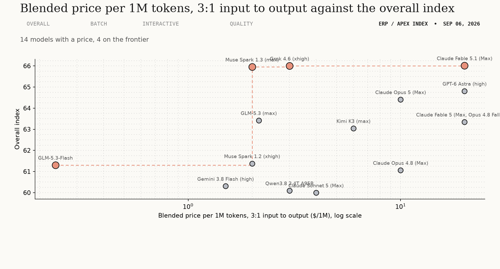
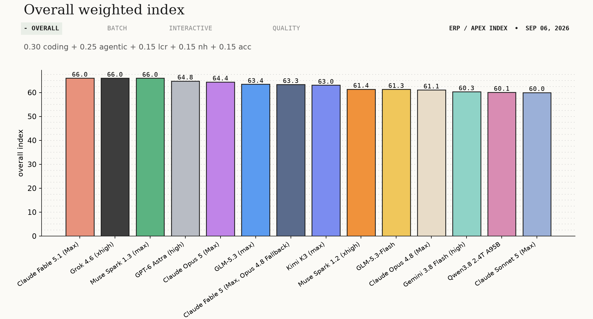
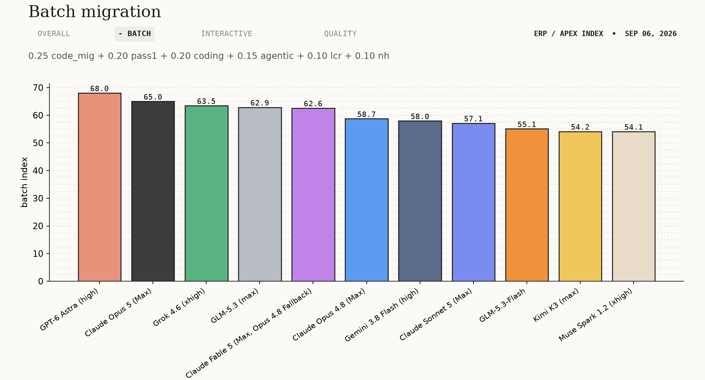
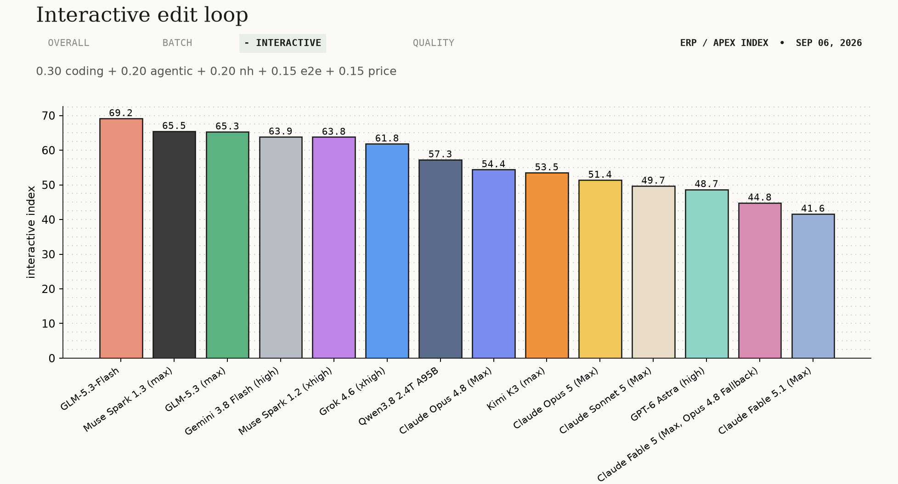
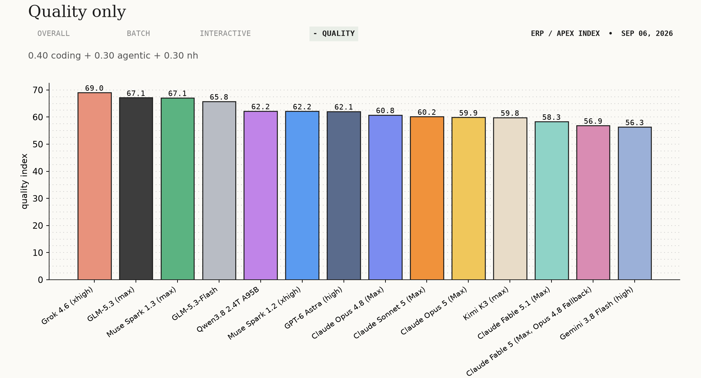
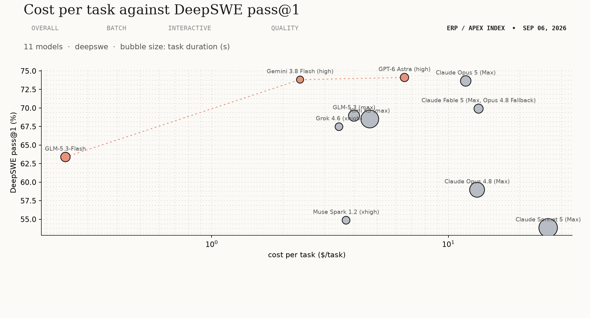
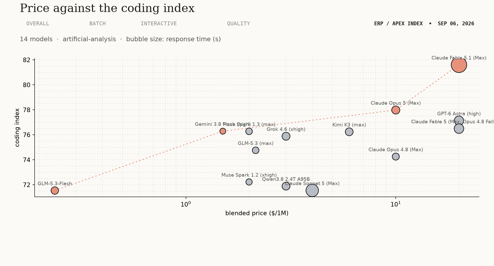
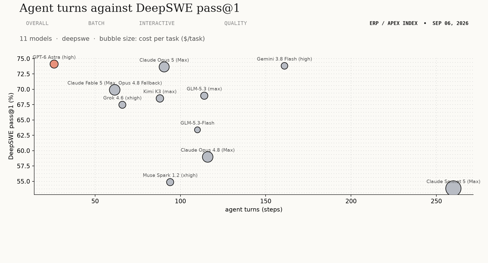

# ERP / Oracle APEX model shortlist

## Read first

Stack: Oracle APEX, Oracle DB, JS, HTML/CSS, ERP. Data:
`benchmark-data/20260906/`, ten leaderboards scraped 2026-09-06, scored from
Artificial Analysis, Vals AI and DeepSWE.

**Take Grok 4.6 at $3.00.** Claude Fable 5.1 leads overall by 0.01 index
points, 66.02 against 66.00, and costs $20.00. Four models sit on the price and
score frontier, meaning nothing beats them on both at once: GLM-5.3-Flash $0.24
at 61.31, Muse Spark 1.3 $2.00 at 65.95, Grok 4.6 $3.00 at 66.00, Claude Fable
5.1 $20.00 at 66.02. Above $2.00 that frontier is flat: 65.95, 66.00, 66.02.

**Nothing here measures Oracle APEX.** Two benchmarks stand in. Code Migration
reimplements real programs in another language, which is what a Forms
conversion is. DeepSWE runs an agent across 91 repositories until the task is
done, which is what an unattended migration run is.

## Indexes and picks

| index | weights | best model | cheap alternative |
|---|---|---|---|
| Overall | `0.3*coding + 0.25*agentic + 0.15*lcr + 0.15*nh + 0.15*acc` | Claude Fable 5.1 (Max) (66.02) | Grok 4.6 (xhigh) (66, 0.01 behind, 6.7x cheaper) |
| Batch migration | `0.25*code_mig + 0.2*pass1 + 0.2*coding + 0.15*agentic + 0.1*lcr + 0.1*nh` | GPT-6 Astra (high) (68.04) | Grok 4.6 (xhigh) (63.46, 4.58 behind, 6.7x cheaper) |
| Interactive edit loop | `0.3*coding + 0.2*agentic + 0.2*nh + 0.15*e2e [inverse_log_minmax] + 0.15*price [inverse_log_minmax]` | GLM-5.3-Flash (69.15) | none qualifies |
| Quality only | `0.4*coding + 0.3*agentic + 0.3*nh` | Grok 4.6 (xhigh) (69.04) | GLM-5.3-Flash (65.76, 3.27 behind, 12.6x cheaper) |

Price and speed are scored by inverse log min-max across these fourteen models,
so they are relative, not absolute. A model missing a benchmark is left out of that
index rather than filled in. The table below can fill it on request, and marks
every cell it filled.

## Every model, every metric

| model | coding | agentic | lcr | nh | acc | price ($/1M) | e2e (s) | ttft (s) | code_mig | corpfin | pass1 (%) | task_cost ($/task) | steps (steps) | dur (s) | batch (0-100) | interactive (0-100) | quality (0-100) | overall (0-100) |
|---|---|---|---|---|---|---|---|---|---|---|---|---|---|---|---|---|---|---|
| Claude Fable 5.1 (Max) | 81.6 | 58.16 | 85.33 | 27.42 | 67.23 | 20 | 272.01 | 264.91 | 54.61 |  |  |  |  |  |  | 41.6 | 58.31 | 66.02 |
| Grok 4.6 (xhigh) | 75.88 | 52.95 | 81 | 75.99 | 43 | 3 | 65.95 | 58.18 | 44.57 | 66.16 | 67.48 | 3.45 | 66 | 895.54 | 63.46 | 61.85 | 69.04 | 66 |
| Muse Spark 1.3 (max) | 76.28 | 55.57 | 84.33 | 66.35 | 43.83 | 2 | 31.84 | 18.69 |  |  |  |  |  |  |  | 65.46 | 67.09 | 65.95 |
| GPT-6 Astra (high) | 77.13 | 48.87 | 80 | 55.23 | 61.13 | 20 | 102.74 | 94.97 | 67.74 |  | 74.12 | 6.52 | 26 | 1132.4 | 68.04 | 48.68 | 62.08 | 64.81 |
| Claude Opus 5 (Max) | 77.98 | 56.43 | 79.33 | 39.18 | 60.87 | 10 | 70.76 | 62.06 | 57.47 | 73.19 | 73.65 | 11.84 | 90.5 | 1911.82 | 65.01 | 51.39 | 59.88 | 64.41 |
| GLM-5.3 (max) | 74.76 | 53.6 | 79.67 | 70.45 | 33.85 | 2.15 | 30.97 | 2.31 | 44.22 |  | 68.96 | 3.99 | 114 | 2116.18 | 62.85 | 65.32 | 67.12 | 63.42 |
| Claude Fable 5 (Max, Opus 4.8 Fallback) | 76.49 | 51.18 | 82.33 | 36.36 | 65.35 | 20 | 110.9 | 103.55 | 55.06 | 71.83 | 69.91 | 13.41 | 61.5 | 1411.58 | 62.59 | 44.81 | 56.86 | 63.35 |
| Kimi K3 (max) | 76.24 | 50.86 | 88.67 | 46.8 | 47.58 | 6 | 63.61 | 3.52 | 16.1 | 71.56 | 68.51 | 4.65 | 88 | 4541.45 | 54.15 | 53.53 | 59.8 | 63.05 |
| Muse Spark 1.2 (xhigh) | 72.22 | 44.2 | 79 | 66.71 | 45.38 | 2 | 22.23 | 14.04 | 29.95 | 70.94 | 54.87 | 3.7 | 94 | 927.87 | 54.11 | 63.78 | 62.16 | 61.38 |
| GLM-5.3-Flash | 71.53 | 51.46 | 80 | 72.37 | 27.5 | 0.24 | 53.07 | 1.5 | 20.52 |  | 63.39 | 0.24 | 110 | 1537.8 | 55.07 | 69.15 | 65.76 | 61.31 |
| Claude Opus 4.8 (Max) | 74.25 | 42.8 | 77.67 | 60.75 | 48.83 | 10 | 41.79 | 33.87 | 47.25 | 66.71 | 58.97 | 13.22 | 116 | 3492.74 | 58.72 | 54.42 | 60.77 | 61.06 |
| Gemini 3.8 Flash (high) | 76.29 | 41.23 | 81.33 | 44.82 | 54.6 | 1.5 | 12.34 | 10.84 | 36.55 |  | 73.83 | 2.36 | 161 | 686.77 | 57.96 | 63.86 | 56.33 | 60.31 |
| Qwen3.8 2.4T A95B | 71.89 | 50.68 | 80.33 | 60.82 | 31.25 | 3 | 64.57 | 2.55 |  |  |  |  |  |  |  | 57.26 | 62.21 | 60.1 |
| Claude Sonnet 5 (Max) | 71.55 | 44.53 | 82 | 60.63 | 40.05 | 4 | 190.27 | 184.73 | 44.39 | 66.98 | 53.85 | 26.4 | 260 | 4803.54 | 57.12 | 49.67 | 60.17 | 60 |

## Price against an index

## Overall (0.30 coding + 0.25 agentic + 0.15 lcr + 0.15 nh + 0.15 acc)

| model | overall | coding | $/1M |
|---|---|---|---|
| Claude Fable 5.1 (Max) | 66.02 | 81.60 | 20.00 |
| Grok 4.6 (xhigh) | 66.00 | 75.88 | 3.00 |
| Muse Spark 1.3 (max) | 65.95 | 76.28 | 2.00 |
| GPT-6 Astra (high) | 64.81 | 77.13 | 20.00 |

The stack independent index, the same in every report on this toolkit, so two
reports can be read against each other.

**Pick Grok 4.6.** It trails Claude Fable 5.1 by 0.01 index points and costs 6.7
times less. Fable 5.1 buys that hundredth of a point with a non-hallucination
rate of 27.42 against Grok's 75.99.

**Cheaper: Muse Spark 1.3**, 0.05 behind at $2.00. It has no Code Migration and
no DeepSWE row, so it carries no batch score at all.

## Batch migration (0.25 code_mig + 0.20 pass1 + 0.20 coding + 0.15 agentic + 0.10 lcr + 0.10 nh)

| model | batch | Code Migration | pass@1 | $/1M |
|---|---|---|---|---|
| GPT-6 Astra (high) | 68.04 | 67.74 ±4.216 | 74.12 | 20.00 |
| Claude Opus 5 (Max) | 65.01 | 57.47 ±4.371 | 73.65 | 10.00 |
| Grok 4.6 (xhigh) | 63.46 | 44.57 ±4.479 | 67.48 | 3.00 |
| GLM-5.3 (max) | 62.85 | 44.22 | 68.96 | 2.15 |

Long unattended runs converting Forms and PL/SQL, where a job runs for an hour
and nobody watches it. Two benchmarks carry that shape: Code Migration
reimplements real programs in another language, and DeepSWE runs an agent
across 91 repositories until the task is done or it fails.

**Pick GPT-6 Astra.** It leads Code Migration at 67.74 against Opus 5's 57.47,
a gap outside their combined standard error, and leads pass@1 at 74.12. It is
also the most expensive model on the page at $20.00 per million tokens.

**Cheaper: Grok 4.6**, 4.58 index points behind at 6.7 times cheaper. Its Code
Migration score of 44.57 is most of that gap; its pass@1 of 67.48 is within
seven points of the leader.

**Three models have no batch score.** Muse Spark 1.3 and Qwen3.8 are missing
both inputs. Claude Fable 5.1 has Code Migration but no DeepSWE row, so adding
pass@1 to this index took it out: it is first on overall and absent here.

## Interactive edit loop (0.30 coding + 0.20 agentic + 0.20 nh + 0.15 e2e + 0.15 price)

| model | interactive | e2e (s) | $/1M |
|---|---|---|---|
| GLM-5.3-Flash | 69.15 | 53.07 | 0.24 |
| Muse Spark 1.3 (max) | 65.46 | 31.84 | 2.00 |
| GLM-5.3 (max) | 65.32 | 30.97 | 2.15 |
| Gemini 3.8 Flash (high) | 63.86 | 12.34 | 1.50 |

Page-edit turnaround, where a developer waits at the keyboard and latency costs
more than tokens do.

**Pick GLM-5.3-Flash.** Cheapest in the set by a wide margin at $0.24 per
million tokens, and the highest non-hallucination rate of the four at 72.37. No
cheap alternative is listed because the leader is already the cheap option.

**If waiting is the problem rather than wrong answers, Gemini 3.8 Flash**
answers in 12.34 s against the leader's 53.07 s. It places fourth because its
non-hallucination rate is 44.82.

## Quality only (0.40 coding + 0.30 agentic + 0.30 nh)

| model | quality | coding | non-halluc |
|---|---|---|---|
| Grok 4.6 (xhigh) | 69.04 | 75.88 | 75.99 |
| GLM-5.3 (max) | 67.12 | 74.76 | 70.45 |
| Muse Spark 1.3 (max) | 67.09 | 76.28 | 66.35 |
| GLM-5.3-Flash | 65.76 | 71.53 | 72.37 |

Cost and speed removed, for work where a wrong answer costs more than a slow
one.

**Pick Grok 4.6.** It does not lead coding, where Claude Fable 5.1 scores 81.60
against its 75.88. It leads because it refuses to invent an answer far more
often, 75.99 against Fable 5.1's 27.42. On a schema you cannot verify by eye,
that trade is worth taking.

**Cheaper: GLM-5.3-Flash**, fourth at 3.27 points behind and 12.6 times cheaper.

## Cost, effort and speed

What an index cannot say: what one task costs, how many turns it takes, how
long it runs. Each chart names its source, so a site going quiet costs one
chart and not the section. Bubble size carries a third metric. The dotted line
joins the models nothing beats on both axes at once.

DeepSWE carries cost, turns and duration per task, and nothing else on the ten
sites does. Artificial Analysis carries price and response time for every
candidate, which is why the middle chart reads price against the coding index
rather than against pass@1: it stands whether or not DeepSWE publishes again.

## Stack tooling

Researched with `last30days` over 2026-08-07 to 2026-09-06. Official means the
vendor ships it. Nothing here is an installation recommendation: an MCP server
is code that runs on your machine with your credentials.

**[MCP] SQLcl MCP Server** &middot; official, Oracle &middot; ships inside the
SQLcl binary, current line 26.2.2 &middot;
`docs.oracle.com/en/database/oracle/sql-developer-command-line` &middot;
**write capable**: `run-sql` executes SQL and PL/SQL, no documented read-only
mode, inherits the saved connection's privileges. Oracle's mitigation is
auditing, not restriction.

**[MCP] oracle/mcp** &middot; official, Oracle &middot; last push 2026-09-03
&middot; `github.com/oracle/mcp` &middot; dbtools server, Java toolkit, docs
server, GoldenGate. The SQLcl server is not in it.

**[MCP] danielmeppiel/oracle-mcp-server** &middot; community, 131 stars &middot;
last push 2025-08-22 &middot; `github.com/danielmeppiel/oracle-mcp-server`
&middot; the only one documenting a read-only default, and twelve months stale.

**[MCP] Chrome DevTools MCP** &middot; official, Google &middot; v1.8.0
2026-08-25 &middot; `github.com/ChromeDevTools/chrome-devtools-mcp` &middot;
2026-08-24 made `pageId` required for page scoped tools, which breaks existing
prompts.

**[MCP] Playwright MCP** &middot; official, Microsoft &middot; v0.0.80
2026-09-01 &middot; `github.com/microsoft/playwright-mcp` &middot; drives from
accessibility tree snapshots rather than screenshots.

**[SKILL] oracle/skills** &middot; official, Oracle, UPL-1.0 &middot; last push
2026-09-04 &middot; `github.com/oracle/skills` &middot; carries `apex/apexlang`,
release 2026.08.28 added template components and compiler backed contracts.
Installed through the SQLcl `skills` command.

**[SKILL] oracle-forms-migration.agent.md** &middot; official, Oracle &middot;
described 2026-05-03 &middot; `blogs.oracle.com/apex` &middot; an agent file
rather than a server, for Forms conversion.

**[SKILL] avhrst/apex-component-modifier** &middot; community, 36 stars &middot;
last commit 2026-03-29 &middot; the highest starred community APEX skill.

**[BEST PRACTICE] Do not authenticate MCP with database accounts** &middot;
2026-09-02 &middot; Jeff Smith, SQLcl product manager, argues for the server in
the mid-tier. On 2026-09-06 an r/mcp thread described an agent writing a valid
query that crossed a tenant boundary, with no injection involved.

**[BEST PRACTICE] Stop preloading MCP servers** &middot; in-window &middot; a
measurement of 106 servers found a 1,700 times spread in per request token cost,
charged whether a tool is called or not, GitHub's official server at roughly
17,600 tokens. The default moved to two to four vetted servers.

**[BEST PRACTICE] Treat a large skill pack as a liability** &middot; in-window
&middot; skills argue at startup and file names clash and quietly overwrite each
other. Claude Code 2.1.261 on 2026-09-04 added `/skill-doctor`, which lists
loaded but unused skills and their context cost.

**[BEST PRACTICE] An MCP server is supply chain** &middot; 2026-08-12 &middot;
Pillar documented Deadbugz, a server that behaves for three tool calls then
changes the instructions it returns, steering agents at SSH keys and AWS
credentials, distributed through 23 pull requests from one account in 74
minutes. CVE-2026-77318 and CVE-2026-77359 in jupyter-mcp-server scored 9.3.

**Absent:** no APEX specific MCP server exists. The public registry carried no
`com.oracle` namespace on 2026-09-06, the largest community one is archived and
pinned to APEX 24.2, and nothing new appeared in the window.

## Caveats

1. The 20260904 report gave Claude Fable 5.1 a DeepSWE pass@1 of 69.91% and $13.41 per task, both read off the `claude-fable-5` row. DeepSWE has no row for 5.1. The join rule was fixed and both cells are empty here.
2. Artificial Analysis emptied more than a third of its Agentic Index between the two scrapes, 197 models then against 119 now. Every index here shifted for measurement reasons rather than model reasons, and comparisons against the 20260904 report are not like for like.
3. Nothing on any of the ten leaderboards tests Oracle APEX. Every claim here is a proxy claim.
4. Latency is one day's reading. Muse Spark 1.3 moved 26 seconds in 48 hours.
5. Speed and price are scored relative to these fourteen candidates. The interactive index is not portable to a different candidate set.
6. Code Migration standard errors run between 4.18 and 4.81. Any two models inside about 9 points of each other are tied on that benchmark.
7. Vals AI CorpFin v2 covers 134 models and excludes five of the seven models discussed here. It feeds no index and appears as context only.
8. The overall index is stack independent by design, so it is comparable across reports. The three role indexes are not.
9. Batch migration weights DeepSWE pass@1 at 0.20. That is a benchmark choice, not a coverage choice: three models carry no DeepSWE row and are absent from the index, Claude Fable 5.1 among them. An index named after unattended migration work has to measure it.

## References

- Artificial Analysis, `artificialanalysis.ai`, coding and agentic indexes, AA-LCR, Omniscience accuracy and non-hallucination, blended 3:1 price, end-to-end latency.
- Vals AI, `vals.ai`, Code Migration and CorpFin v2, both published with standard error.
- DeepSWE, `deepswe.datacurve.ai`, pass@1 and cost per task under the mini-swe-agent scaffold.
- Provenance only: LiveBench, LMArena, Terminal-Bench, ARC Prize, Epoch AI, Design Arena, BenchLM.
- Stack tooling, official: `github.com/oracle/skills`, `github.com/oracle/mcp`, SQLcl MCP documentation at `docs.oracle.com`, `github.com/ChromeDevTools/chrome-devtools-mcp`, `github.com/microsoft/playwright-mcp`, `developer.mozilla.org/en-US/mcp`, `deque.com/axe/mcp-server`, the Claude Code changelog and the MCP roadmap at `blog.modelcontextprotocol.io`.
- Stack tooling, community and incidents: `github.com/TechFernandesLTDA/apex-mcp`, `github.com/avhrst/apex-component-modifier`, `github.com/United-Codes/uc-apx`, `github.com/danielmeppiel/oracle-mcp-server`, `github.com/runekaagaard/mcp-alchemy`, `github.com/skanga/DBchat`, `github.com/plugin87/ux-ui-agent-skills`, `github.com/meodai/skill.color-expert`, `github.com/JustasMonkev/mcp-accessibility-scanner`, the Deadbugz writeup at `pillar.security`, and r/mcp and r/ClaudeCode threads dated in the window.
- The tooling section covers 2026-08-07 to 2026-09-06 only. It is a snapshot of a fast moving surface, not a maintained list.
- Every number in this report is reproducible from `results.json` in this folder, which carries the raw values, the formula behind each index, and the picks.
