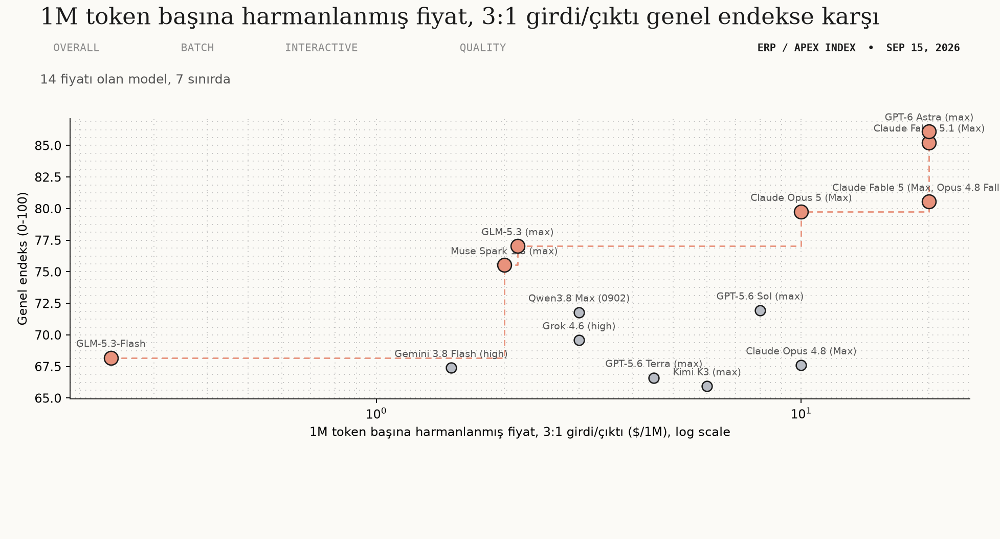
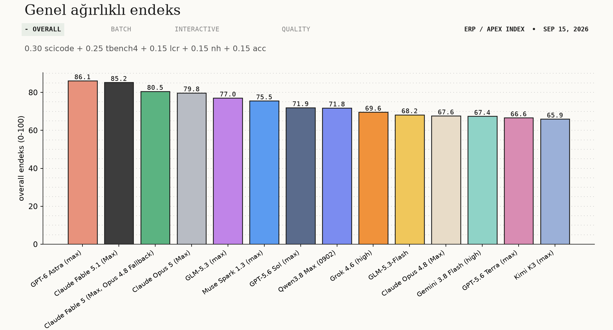
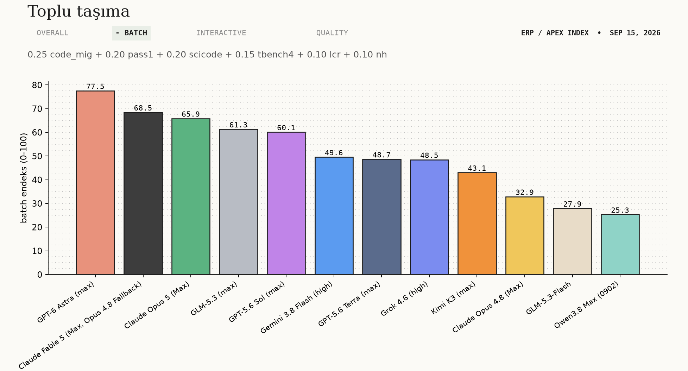
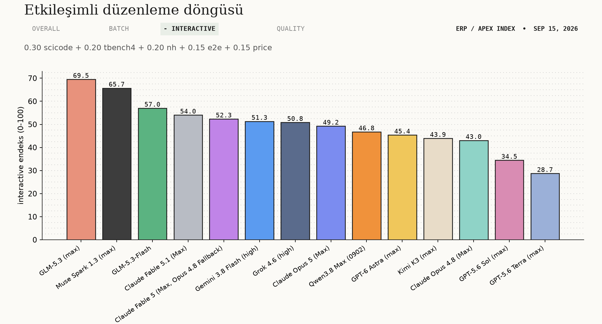
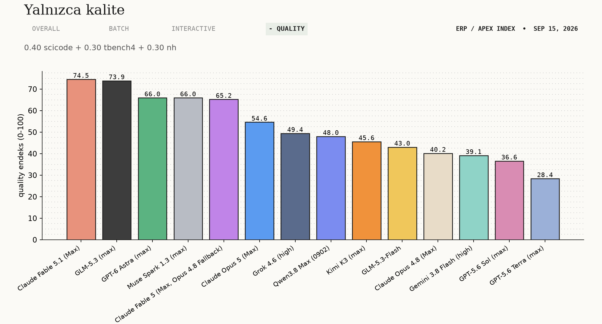
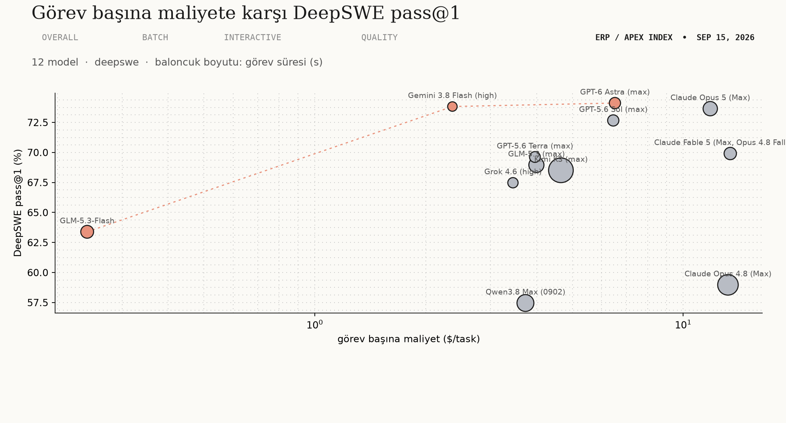
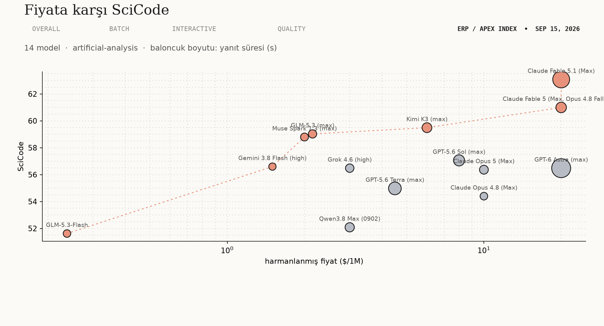
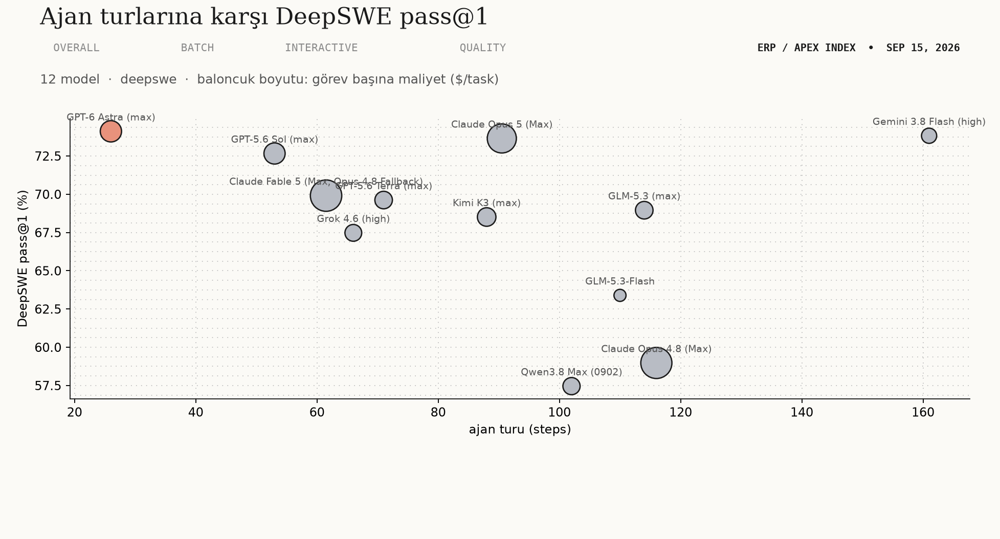

# ERP / Oracle APEX model kısa listesi

## Önce şunu oku

Oracle APEX, Oracle DB, JS ve HTML/CSS üzerinde ERP işi için on kamu leaderboard'undan 2026-09-15 taraması, `benchmark-data/20260915`.

**Seçim: GPT-6 Astra (max).** Genel endekste 86.12 ile birinci ve Toplu taşımada 77.54 ile yine birinci, yani hem genel hem de bu stack'in en ağır işinde önde. Ama $20/1M ile settteki en pahalı üç modelden biri ve 20260915 taramasında uçtan uca 291.76 s ile en yavaşı, o yüzden her iş ona gitmemeli: Etkileşimli düzenleme döngüsünde 45.38 ile 14 adayın 10'uncusuna düşüyor.

**Sınır:** GLM-5.3-Flash $0.2375/1M, 68.19. Muse Spark 1.3 (max) $2/1M, 75.53. GLM-5.3 (max) $2.15/1M, 77.03. Claude Opus 5 (Max) $10/1M, 79.75. Claude Fable 5 (Max, Opus 4.8 Fallback) $20/1M, 80.55. Claude Fable 5.1 (Max) $20/1M, 85.24. GPT-6 Astra (max) $20/1M, 86.12. Bu yedisini hem fiyatta hem genel endekste aynı anda geçen başka model yok.

**Bu rapor neyi ölçemez:** hiçbir benchmark Oracle APEX'in kendisini çalıştırmıyor, bu yüzden bütün APEX yargısı kod yazma, ajan işi ve kod taşıma üzerinden dolaylıdır.

## Endeksler ve seçimler

| endeks | ağırlıklar | en iyi model | ucuz alternatif |
|---|---|---|---|
| Overall | `0.3*scicode + 0.25*tbench4 + 0.15*lcr + 0.15*nh + 0.15*acc` | GPT-6 Astra (max) (86.12) | GLM-5.3 (max) (77.03, 9.09 geride, 9.3x kat ucuz) |
| Toplu taşıma | `0.25*code_mig + 0.2*pass1 + 0.2*scicode + 0.15*tbench4 + 0.1*lcr + 0.1*nh` | GPT-6 Astra (max) (77.54) | uygun model yok |
| Etkileşimli düzenleme döngüsü | `0.3*scicode + 0.2*tbench4 + 0.2*nh + 0.15*e2e [inverse_log_minmax] + 0.15*price [inverse_log_minmax]` | GLM-5.3 (max) (69.52) | uygun model yok |
| Yalnızca kalite | `0.4*scicode + 0.3*tbench4 + 0.3*nh` | Claude Fable 5.1 (Max) (74.55) | GLM-5.3 (max) (73.88, 0.67 geride, 9.3x kat ucuz) |

Bu koşuda candidate_minmax açık. Her terim önce bu 14 adayın içinde 0-100 bandına geriliyor, sonra ağırlıklanıyor. Bunun iki sonucu var. Beyan edilen ağırlık gerçekten o ağırlık: motor `scicode 0.3->30%` yazıyor, tahmin değil ölçüm. Ve hiçbir puan mutlak değil, aday kümesi değişirse hepsi değişir. Fiyat ve gecikme ayrıca ters log ölçekli, yani onlar da bu 14 modele göre.

Ucuz alternatif kuralı, lideri 10 puandan fazla geçmeyen ve en az 3 kat ucuz olan en yüksek puanlı model. O 10 puan endeksin kendi biriminde: adaylar arasında Overall 20.2, Toplu taşıma 52.2, Etkileşimli 40.8, Yalnızca kalite 46.1 puan yayılıyor.

## Her model, her metrik

| model | lcr | nh | acc | price ($/1M) | e2e (s) | ttft (s) | scicode | tbench4 | code_mig | corpfin | pass1 (%) | task_cost ($/task) | steps (steps) | dur (s) | batch (0-100) | interactive (0-100) | quality (0-100) | overall (0-100) |
|---|---|---|---|---|---|---|---|---|---|---|---|---|---|---|---|---|---|---|
| GPT-6 Astra (max) | 80.67 | 48.66 | 62.6 | 20 | 291.76 | 282.5 | 56.48 | 59.09 | 67.74 |  | 74.12 | 6.52 | 26 | 1132.4 | 77.54 | 45.38 | 65.96 | 86.12 |
| Claude Fable 5.1 (Max) | 85.33 | 27.42 | 67.23 | 20 | 242.56 | 234.98 | 63.08 | 52.02 | 54.61 |  |  |  |  |  |  | 54.02 | 74.55 | 85.24 |
| Claude Fable 5 (Max, Opus 4.8 Fallback) | 82.33 | 36.36 | 65.35 | 20 | 93.19 | 85.45 | 61 | 42.42 | 55.06 | 71.83 | 69.91 | 13.41 | 61.5 | 1411.58 | 68.47 | 52.34 | 65.24 | 80.55 |
| Claude Opus 5 (Max) | 79.33 | 39.18 | 60.87 | 10 | 53.51 | 43.51 | 56.37 | 48.99 | 57.47 | 73.19 | 73.65 | 11.84 | 90.5 | 1911.82 | 65.87 | 49.23 | 54.63 | 79.75 |
| GLM-5.3 (max) | 79.67 | 70.45 | 33.85 | 2.15 | 40.65 | 3.09 | 59.03 | 41.92 | 44.22 |  | 68.96 | 3.99 | 114 | 2116.18 | 61.33 | 69.52 | 73.88 | 77.03 |
| Muse Spark 1.3 (max) | 83 | 67.06 | 43.58 | 2 | 31.89 | 20.57 | 58.8 | 33.33 |  |  |  |  |  |  |  | 65.71 | 65.95 | 75.53 |
| GPT-5.6 Sol (max) | 84 | 7.8 | 59.4 | 8 | 107.14 | 99.4 | 57.06 | 39.9 | 52.92 | 64.38 | 72.67 | 6.46 | 53 | 1128.62 | 60.14 | 34.45 | 36.6 | 71.95 |
| Qwen3.8 Max (0902) | 80.33 | 71.16 | 31.68 | 3 | 63.21 | 2.72 | 52.08 | 38.89 | 23.96 | 65.85 | 57.46 | 3.73 | 102 | 2567.27 | 25.33 | 46.76 | 48.01 | 71.79 |
| Grok 4.6 (high) | 80.33 | 65.71 | 48.23 | 3 | 44.65 | 36.19 | 56.48 | 21.21 | 44.57 | 66.16 | 67.48 | 3.45 | 66 | 895.54 | 48.46 | 50.84 | 49.42 | 69.58 |
| GLM-5.3-Flash | 80 | 72.37 | 27.5 | 0.24 | 24.31 | 2.45 | 51.62 | 32.83 | 20.52 |  | 63.39 | 0.24 | 110 | 1537.8 | 27.9 | 57.02 | 43.04 | 68.19 |
| Claude Opus 4.8 (Max) | 77.67 | 60.75 | 48.83 | 10 | 25.33 | 16.43 | 54.4 | 21.72 | 47.25 | 66.71 | 58.97 | 13.22 | 116 | 3492.74 | 32.88 | 43.03 | 40.17 | 67.6 |
| Gemini 3.8 Flash (high) | 81.33 | 44.82 | 54.6 | 1.5 | 17.77 | 16.28 | 56.6 | 19.7 | 36.55 |  | 73.83 | 2.36 | 161 | 686.77 | 49.59 | 51.31 | 39.14 | 67.39 |
| GPT-5.6 Terra (max) | 83 | 12.12 | 46.8 | 4.5 | 144.7 | 139.76 | 54.98 | 35.35 | 47.8 | 65.31 | 69.62 | 3.96 | 71 | 1016.67 | 48.67 | 28.72 | 28.4 | 66.61 |
| Kimi K3 (max) | 88.67 | 46.8 | 47.58 | 6 | 76.42 | 4.52 | 59.49 | 12.63 | 16.1 | 71.56 | 68.51 | 4.65 | 88 | 4541.45 | 43.05 | 43.94 | 45.6 | 65.95 |

Boş hücre veri yokluğudur, sıfır değildir. Claude Fable 5.1 (Max) DeepSWE'de yok: site yalnızca `claude-fable-5` yayımlıyor, o başka bir model, bu yüzden `pass1`, `task_cost`, `steps` ve `dur` boş ve model Toplu taşıma endeksine hiç girmiyor. Muse Spark 1.3 (max) hem Code Migration satırı taşımıyor hem de DeepSWE'de yok: site yalnızca Muse Spark 1.1 ve 1.2 yayımlıyor. Bu yüzden `code_mig`, `pass1`, `task_cost`, `steps` ve `dur` boş ve o da Toplu taşıma dışında. `corpfin` 14 adayın 8'ini kapsıyor ve hiçbir rolde ağırlığı yok, yalnızca bağlam olarak duruyor.

## Fiyata karşı endeks

## Overall (0.30 scicode + 0.25 tbench4 + 0.15 lcr + 0.15 nh + 0.15 acc)

| model | overall | scicode | tbench4 | $/1M |
|---|---|---|---|---|
| GPT-6 Astra (max) | 86.12 | 56.48 | 59.09 | 20 |
| Claude Fable 5.1 (Max) | 85.24 | 63.08 | 52.02 | 20 |
| Claude Fable 5 (Max, Opus 4.8 Fallback) | 80.55 | 61 | 42.42 | 20 |
| Claude Opus 5 (Max) | 79.75 | 56.37 | 48.99 | 10 |

**Seçim: GPT-6 Astra (max), 86.12.** Terminal-Bench 4.0'da 59.09 ile settteki en yüksek puan ve Code Migration'da 67.74 ile yine birinci. İkinci sıradaki Claude Fable 5.1 (Max) 85.24 ile 0.88 puan geride, ki bu 20.2 puanlık bir yayılımın içinde küçük bir fark.

**Daha ucuzu: GLM-5.3 (max), 77.03.** Lideri 9.09 puan geride ama $2.15/1M ile 9.3 kat ucuz. Uydurmama oranı 70.45, GPT-6 Astra'nın 48.66'sının belirgin üstünde. Doğruluk tarafında ters yönde bir takas var: GLM-5.3'ün `acc` değeri 33.85, GPT-6 Astra'nın 62.60. İkisi birlikte okunur, çünkü yüksek çekilme artı düşük doğruluk modelin bildiğini değil sustuğunu gösterir.

## Toplu taşıma (0.25 code_mig + 0.20 pass1 + 0.20 scicode + 0.15 tbench4 + 0.10 lcr + 0.10 nh)

| model | batch | code_mig | pass1 (%) | $/1M |
|---|---|---|---|---|
| GPT-6 Astra (max) | 77.54 | 67.74 | 74.12 | 20 |
| Claude Fable 5 (Max, Opus 4.8 Fallback) | 68.47 | 55.06 | 69.91 | 20 |
| Claude Opus 5 (Max) | 65.87 | 57.47 | 73.65 | 10 |
| GLM-5.3 (max) | 61.33 | 44.22 | 68.96 | 2.15 |

**Seçim: GPT-6 Astra (max), 77.54.** Code Migration 67.74 ve DeepSWE pass@1 74.12 ile endeksin en ağır iki teriminde de birinci. Görev başına 26 tur harcıyor, settteki en düşük tur sayısı, ve görev başına $6.52.

**Ucuz alternatif yok.** İkinci sıradaki Claude Fable 5 (Max, Opus 4.8 Fallback) 68.47 ile 9.07 geride ama aynı fiyatta, $20/1M. On puan içindeki tek başka model o. Üç kat ucuz olanların hepsi on puandan fazla geride.

Claude Fable 5.1 (Max) ve Muse Spark 1.3 (max) bu endekste hiç görünmüyor. İkisinin de eksik girdisi var ve eksik bir benchmark asla doldurulmaz.

## Etkileşimli düzenleme döngüsü (0.30 scicode + 0.20 tbench4 + 0.20 nh + 0.15 e2e + 0.15 price)

| model | interactive | e2e (s) | nh | $/1M |
|---|---|---|---|---|
| GLM-5.3 (max) | 69.52 | 40.65 | 70.45 | 2.15 |
| Muse Spark 1.3 (max) | 65.71 | 31.89 | 67.06 | 2 |
| GLM-5.3-Flash | 57.02 | 24.31 | 72.37 | 0.24 |
| Claude Fable 5.1 (Max) | 54.02 | 242.56 | 27.42 | 20 |

**Seçim: GLM-5.3 (max), 69.52.** SciCode 59.03 ile dördüncü, uydurmama 70.45, ilk token 3.09 s ve fiyat $2.15/1M. Bu rolde tek bir şeyde birinci değil, hiçbirinde de kötü değil, endeksi kazanan da bu.

**Ucuz alternatif yok.** Muse Spark 1.3 (max) 65.71 ile 3.81 geride ve $2/1M ile yalnızca 1.1 kat ucuz, yani üç kat eşiğini geçemiyor. GLM-5.3-Flash 9 kat ucuz ama 57.02 ile 12.5 puan geride.

Buradaki genel seçim GPT-6 Astra 45.38 ile 14 adayın 10'uncusuna düşüyor. Sebebi uçtan uca 291.76 s ve $20/1M: bir düzenleme döngüsünde ikisi de doğrudan bekleme ve fatura demek.

## Yalnızca kalite (0.40 scicode + 0.30 tbench4 + 0.30 nh)

| model | quality | scicode | nh | $/1M |
|---|---|---|---|---|
| Claude Fable 5.1 (Max) | 74.55 | 63.08 | 27.42 | 20 |
| GLM-5.3 (max) | 73.88 | 59.03 | 70.45 | 2.15 |
| GPT-6 Astra (max) | 65.96 | 56.48 | 48.66 | 20 |
| Muse Spark 1.3 (max) | 65.95 | 58.8 | 67.06 | 2 |

**Seçim: Claude Fable 5.1 (Max), 74.55.** SciCode 63.08 ile settteki en yüksek kod yazma puanı ve Terminal-Bench 4.0'da 52.02.

**Daha ucuzu: GLM-5.3 (max), 73.88.** Aradaki fark **0.67 puan**, 46.1 puan yayılan bir endekste. GLM-5.3 aynı işi **9.3 kat ucuza** yapıyor. Bu raporun en kullanışlı satırı bu.

Fark yalnızca fiyat değil. Claude Fable 5.1'in uydurmama oranı 27.42, 14 adayın 12'ncisi; yalnızca GPT-5.6 Sol (7.80) ve GPT-5.6 Terra (12.12) daha aşağıda. GLM-5.3'ünki 70.45. PL/SQL'de olmayan bir builtin uydurmanın bedeli bir öğleden sonra olduğu için, bu kolon bu stack'te kağıt üstündeki 0.67 puandan daha çok şey söyler.

## Maliyet, tur sayısı ve süre

Bu üç grafik DeepSWE v1.1 ve Artificial Analysis'ten geliyor. DeepSWE kolonları 14 adayın 12'sini kapsıyor.

Tur sayısı verimliliği görünür kılan kolon. GPT-6 Astra bir görevi 26 turda bitiriyor, Gemini 3.8 Flash 161 turda. Aradaki fark görev başına maliyete birebir yansımıyor: GPT-6 Astra $6.52, Gemini 3.8 Flash $2.36. Az tur her zaman ucuz değildir, çünkü tur başına düşünme token'ı da değişiyor.

GLM-5.3-Flash görev başına $0.24 ile settteki en ucuzu, ama pass@1 63.39 ile DeepSWE satırı taşıyan 12 modelin 10'uncusu. Kimi K3 bir görevi 4541.45 saniyede bitiriyor, en uzunu.

## 20260906'dan bu yana ne değişti

**Artificial Analysis iki endeksi yayımlamayı bıraktı.** 20260906 taramasında Coding Index 255 satır, Agentic Index 119 satır taşıyordu. 20260915 taramasında ikisi de yok. AA-Openness Index (314 satır), AA-Multilingual Index (112 satır) ve MLCR (83 satır) de kaldırıldı. Yerine Terminal-Bench 4.0 geldi, 160 satır. Bu iki endeks bu profilin dört endeksinin de içindeydi, o yüzden puanlama tabanı yeniden kuruldu.

**Gecikme sert oynadı, kalite kolonları hiç oynamadı.** GLM-5.3-Flash uçtan uca 53.07 s'den 24.31 s'ye indi, Claude Opus 4.8 41.79 s'den 25.33 s'ye, Claude Opus 5 70.76 s'den 53.51 s'ye. Ters yönde Kimi K3 63.61 s'den 76.42 s'ye çıktı. Aynı dokuz modelin uydurmama oranı iki tarama arasında sekizinde birebir aynı kaldı; yalnızca Muse Spark 1.3 66.35'ten 67.06'ya geçti. Artificial Analysis gecikmeyi her gün yeniden ölçüyor, kalite değerlendirmelerini ölçmüyor.

**Aday setinin beş üyesi değişti.** Giren: GPT-6 Astra (max), GPT-5.6 Sol (max), GPT-5.6 Terra (max), Qwen3.8 Max (0902), Grok 4.6 (high). Çıkan: GPT-6 Astra (high), Grok 4.6 (xhigh), Claude Sonnet 5 (Max), Muse Spark 1.2 (xhigh), Qwen3.8 2.4T A95B. Bunların bir kısmı yeni model değil, aynı modelin farklı efor varyantının öne geçmesi: GPT-6 Astra (high) yerine (max), Grok 4.6 (xhigh) yerine (high). Qwen3.8 Max (0902) ise Artificial Analysis'e bu tarama ile giren dokuz modelden biri, yani gerçekten yeni. Arkasında 30 günlük bir web taraması yok, çünkü araştırma penceresi kapandığında henüz leaderboard'da değildi; endeksteki yeri yalnızca bu taramanın sayılarına dayanıyor.

## Stack araçları

Araştırma `last30days` ile 2026-08-16 ile 2026-09-15 arasında yapıldı. Resmî olan ile topluluk olanı ayrı yazıyorum, çünkü tanıdık isim taşıyan bir topluluk sunucusu en eski tedarik zinciri numarasıdır. Buradaki hiçbir satır kurulum tavsiyesi değil: bir MCP sunucusu senin makinende senin kimlik bilgilerinle çalışan koddur.

### Oracle APEX

APEX için resmî bir MCP sunucusu yok, 2026-09-15 itibarıyla kontrol edildi. Oracle'ın APEX'e bakan ajan yüzü bir sunucu değil, bir skill.

`[SKILL] oracle/skills (apex eklentisi) · resmî, Oracle · 841 yıldız · apex/ son commit 2026-08-29`
Oracle'ın kendi dokümanının işaret ettiği APEXlang skill'i, Claude Code eklenti pazaryeri olarak dağıtılıyor ve SQLcl'den `skills sync` ile kuruluyor. 2026-08-28 sürümü doğrulama çalışma zamanını sıkılaştırdı ve derleyici destekli şablon bileşen sözleşmeleri ekledi, yani uydurulmuş bileşenlere karşı daraltılıyor.

`[MCP] oracle/mcp · resmî, Oracle · 440 yıldız · son push 2026-09-10`
OCI, MySQL, GoldenGate ve DB Tools için 32 referans sunucu, **APEX için hiçbiri**. README'sinde "production için tasarlanmamıştır" yazıyor.

`[SKILL] avhrst/apex-component-modifier · topluluk, 35 yıldız · son commit 2026-03-29`
Yaklaşık altı aydır dokunulmamış olmasına rağmen hâlâ en çok yıldızlı APEX'e özel skill. Bir Oracle çalışanının kişisel projesi.

`[SKILL] andre-simplifica/oracle-apex-ai-skills · topluluk, 20 yıldız · son commit 2026-08-24`
Pencere içinde v1.1.0'dan v1.2.2'ye çıktı, paralel export akışı ekledi. APEX 24.2'yi hedefliyor.

`[MCP] TechFernandesLTDA/apex-mcp · topluluk, 15 yıldız · 2026-08-02'de arşivlendi`
Topluluğun en dolu APEX MCP'siydi, 86 araç ve 15 kategori. Sahibi 26.1'i kovalamak yerine dondurdu. Yerini alan başka bir MCP sunucusu değil, Oracle'ın APEXlang skill rotası.

`[MCP] KwiatekMaster/oracle-apex-mcp · topluluk, 0 yıldız · son commit 2025-10-17`
Yalnızca uyarı olarak yazıyorum: resmî duran bir depo adı, açıklama yok, yıldız yok, on bir aydır ölü.

Pencere içinde APEX, SQLcl veya ORDS için yeni sürüm çıkmadı. Son sürümler APEX 26.1 (2026-05-14), SQLcl 26.2 (Temmuz 2026), ORDS 26.2 (2026-07-02).

### Oracle DB ve PL/SQL

`[MCP] SQLcl MCP server · resmî, SQLcl ikilisinin içinde · SQLcl 26.2, Temmuz 2026`
Ayrı bir depo değil, `sql -mcp` ile başlatılan bir mod. Kimlik bilgisi hiçbir MCP çağrısında gezmiyor: önceden kaydedilmiş adlandırılmış bağlantı gerekiyor.

`[MCP] ORDS 26.2 yerel /mcp uç noktası · resmî, ORDS içinde · 2026-07-02`
Dış kimlik sağlayıcıdan OAuth2/JWT ile akan HTTPS MCP sunucusu, `ORDS_METADATA` şeması gerektirmiyor.

`[MCP] Autonomous AI Database MCP Server · resmî, Oracle · yönetilen ürün özelliği, GA`
Yerel süreç çalıştırmıyor ve ikinci bir kimlik modeli eklemek yerine mevcut RBAC, VPD ve denetimi devralıyor.

`[MCP] danielmeppiel/oracle-mcp-server · topluluk, 132 yıldız · son commit 2025-08-22`
En çok yıldızlı topluluk Oracle MCP'si ve hâlâ önde gelen üçüncü taraf seçenek, ama yaklaşık on üç aydır dokunulmamış.

`[MCP] Vvkmnn/claude-oracle-mcp · topluluk, 3 yıldız · son commit 2026-03-16 · İSİM TUZAĞI`
Adına rağmen bir Oracle veritabanı sunucusu değil. Claude Code için skill keşif sunucusu. "oracle" kelimesini veritabanıyla eşleyen biri yanlış şeyi kurar.

Bu stack için pencerenin en ağır üç bulgusu güvenlik tarafında:

`[BEST PRACTICE] SQLcl MCP başlangıcı 26.1.2'de kısıtlamasıza düştü · Mayıs 2026, pencere öncesi`
Release notes'un kendi cümlesi: "SQLcl MCP startup now defaults to unrestricted. This was previously set to restriction level 4." Bugün çalışan her SQLcl MCP oturumunu bu varsayılan yönetiyor.

`[BEST PRACTICE] SQLcl MCP varsayılanda salt okunur değil ve `run-sql` bağlı kullanıcı olarak SQL ve PL/SQL çalıştırır · pencere içi`
Kaydedilmiş bağlantı ne taşıyorsa onu devralıyor, sık sık bir DBA hesabı. PL/SQL bunu Postgres muadilinden daha keskin yapıyor, çünkü `UTL_FILE` ve `UTL_HTTP` bir sorgu aracını dosya yazma ve dışa ağ yoluna çeviriyor.

`[BEST PRACTICE] CVE-2026-35228: Oracle MCP Server Helper Tool 1.0.1-1.0.156'da kimlik doğrulamasız SQL injection, CVSS 8.7 HIGH · 2026-05-05`
Enjeksiyon vektörü Oracle'ın kendi gönderdiği MCP bileşeniydi. Hiçbir MCP sunucusuna salt okunurdan fazlasını vermemenin somut gerekçesi bu.

Oracle'ın kredi bilgisi cevabı teknik değil prosedürel: ajanları temizlenmiş salt okunur bir replikaya yönlendirmek ve denetim izine yaslanmak. Sunucu `V$SESSION.MODULE`'a MCP istemcisini, `V$SESSION.ACTION`'a LLM adını damgalıyor ve her etkileşimi `DBTOOLS$MCP_LOG`'a yazıyor, ki bu önleme değil tespittir.

Pencere içinde PL/SQL ilk kez çalıştırma ile doğrulanan bir benchmark hedefi oldu: PLSQLBench (2026-08-16) ve etkileşimli geliştirmeyi ekleyen ProcArena (2026-09-06).

### JavaScript, HTML ve CSS

`[MCP] chrome-devtools-mcp · resmî, Google · v1.9.0 2026-09-08 · 52.048 yıldız · son commit 2026-09-15`
Gerçek bir Chrome'u CDP üzerinden sürüyor ve tarayıcının hesapladığını raporluyor: konsol mesajları, ağ istekleri, performans izleri, Lighthouse denetimleri. v1.9.0 ayrıca JS çalıştırma araçlarını tamamen kapatma seçeneği ekledi.

`[MCP] Playwright MCP · resmî, Microsoft · v0.0.81 2026-09-14 · 37.144 yıldız`
Piksel değil erişilebilirlik ağacı tabanlı, bu yüzden düz sunucu tarafında üretilen bir sayfada da çalışıyor.

`[SKILL] anthropics/skills → frontend-design · resmî, Anthropic · son commit 2026-09-03`
2026-09-03'te yeniden yazıldı ve zevk öğütlemek yerine beş somut "yapay zeka izi"ni hex koduyla adlandırdı. Hareket tavsiyesi tersine döndü: bölüm girişlerinde fade-and-slide-up ve her kartta hover geçişi artık kaçınılacak şey. Ayrıca satır uzunluğu için 80 karakter altı kuralı ekledi, ki bu bugün elle yazdığın CSS'e uygulanabilir.

`[MCP] Figma MCP server (Dev Mode) · resmî, Figma · sürüm numarası yok, tarihli changelog yok`
Buradaki bulgu yokluğun kendisi: ne çalıştırdığını söyleyemiyorsun. Tarihsiz bir proje, eski tarihli bir projeden daha zor akıl yürütülür.

`[MCP] executeautomation/mcp-playwright · topluluk, 5.644 yıldız · son commit 2025-12-13`
Eskimiş ve yerine geçilmiş; `microsoft/playwright-mcp` bakımı yapılan karşılığı. Yıldız sayısı bakım demek değil.

`[BEST PRACTICE] Tarayıcı ajanları arayüzü sürmeyi bırakıp sayfanın tanımladığı araçları çağırmaya geçiyor · 2026-09-14`
Playwright MCP v0.0.81 `browser_webmcp_list` ve `browser_webmcp_call` ekledi, Chrome DevTools MCP aynı listelemeyi kazandı. WebMCP sayfa tarafındaki yarısı: araçları düz HTML form elemanları üzerinde ya da `navigator.modelContext` ile tanımlıyorsun, yalnızca HTTPS, `tools` Permissions Policy ile kapılı. Mevcut bir sayfanın içine JavaScript yazan biri için tarayıcı ajanı hikâyesinin ilk defa düz HTML ve vanilla JS olan bir kancası var.

### Ajan araçları, stack'ten bağımsız

`[MCP] Model Context Protocol spesifikasyonu · resmî · revizyon 2026-07-28`
Protokol çekirdeği durumsuz hale geldi, Streamable HTTP'de `Mcp-Method` ve `Mcp-Name` başlıkları zorunlu oldu, ve Dynamic Client Registration resmen kullanımdan kaldırılıp yerine Client ID Metadata Documents geldi.

`[MCP] punkpeye/awesome-mcp-servers · topluluk, 95.046 yıldız · son commit 2026-09-15`
Fiilî keşif yüzeyi, resmî kayıt deposunu bir büyüklük mertebesi geçiyor.

`[MCP] invariantlabs-ai/mcp-scan · topluluk, 3.048 yıldız · son commit 2026-09-10`
Kurulu sunucularda araç zehirlenmesi ve prompt enjeksiyonu riskini tarayan en çok yıldızlı topluluk aracı.

`[MCP] elevenlabs-mcp · resmî, ElevenLabs · 2026-08-20'de ARŞİVLENDİ`
Pencere içinde yerine geçildi. Bu adı taşıyan canlı her fork artık satıcı etiketi giyen bakımsız topluluk kodu.

`[BEST PRACTICE] Bir skill'i veya eklentiyi göndermeden önce eklentisiz bir temele karşı ölç · 2026-09-11`
Claude Code v2.1.269 `claude plugin eval` ekledi: altı değerlendirici türü ve eklentili/eklentisiz kol farkı.

`[BEST PRACTICE] Yetkilendirmeyi modelin erişemediği bir proxy'ye koy ve yazma gerekmeyen yerde salt okunur sunucu gönder · pencere içi`
Ayın en çok oylanan topluluk vitrini bilinçli olarak yazma yeteneği olmayan bir sunucu ve gerekçesi patlama yarıçapını küçültmek.

`[BEST PRACTICE] En çok bağlantı verilen üçüncü taraf MCP güvenlik rehberi eskimiş · taslak tarihi 2026-03-27`
Cloud Security Alliance rehberi hâlâ taslak ve 2025-11-25 spesifikasyonuna göre yazılmış, iki revizyon geride.

## Uyarılar

1. Bu raporun `overall` endeksi 20260906 raporununkiyle **karşılaştırılamaz**. Artificial Analysis Coding Index ve Agentic Index yayımlanmayı bıraktığı için formül değişti, ayrıca `normalize: candidate_minmax` açıldı. İki rapordaki aynı isimli kolon aynı şeyi ölçmüyor.
2. `coding` ve `agentic` kolonları `scicode` ve `tbench4` olarak yeniden adlandırıldı. Eski adlar bırakılsaydı, 20260906'daki 71-82 aralığıyla buradaki 51-63 aralığı yan yana okunur ve olmayan bir çöküş görülürdü.
3. SciCode ve Terminal-Bench 4.0 isimlerine göre değil, iki ölçümle seçildi: aday kümesi kapsamı (ikisi de 14/14) ve yayılım. Terminal-Bench 2.1 ve GPQA Diamond kapsamı tam olduğu halde elendi, çünkü bu 14 model üzerinde yayılımları 0.075 ve 0.049; tavana yapışmış bir benchmark sıralama üretemez.
4. Her puan bu 14 adaya görelidir. `normalize: candidate_minmax` her terimi aday kümesi içinde geriyor, fiyat ve gecikme ayrıca ters log ölçekli. Aday kümesine bir model eklenirse herkesin puanı değişir.
5. `cheap_alternative.max_points_behind` 5.0'dan 10.0'a çıkarıldı. Tolerans endeksin kendi biriminde ve `normalize` ile aralıklar yaklaşık üç kat genişledi (Overall 6.0'dan 20.2'ye). 5.0'ı bırakmak kuralı gevşetmez, sessizce sıkılaştırırdı.
6. Eksik bir benchmark asla doldurulmaz. Claude Fable 5.1 (Max) DeepSWE satırı taşımadığı, Muse Spark 1.3 (max) Code Migration satırı taşımadığı için ikisi de Toplu taşıma endeksinde yok.
7. Gecikme rakamları o günün okumasıdır. Artificial Analysis gecikmeyi her gün yeniden ölçüyor ve dokuz günde bazı modeller yarı yarıya oynadı.
8. Terminal-Bench sürümleri karşılaştırılamaz. 2.1'de 89 alan bir model 4.0'da 19'da kalabilir. Bu raporda yalnızca 4.0 kullanıldı.
9. Bu profilin rolleri ve ağırlıkları arkasında bir `adhd` koşusu yok. Ağırlıklar 20260906 profilinden devralındı ve yalnızca kaldırılan iki endeksin yerine geçen terimler için yeniden adlandırıldı.
10. `corpfin` 14 adayın 8'ini kapsıyor, THIN sayılır. Hiçbir rolde ağırlığı yok, bu yüzden hiçbir sıralamayı etkilemiyor.

## Kaynaklar

**Puanlama kaynakları.** Artificial Analysis (`artificialanalysis.ai`), `scicode`, `tbench4`, `lcr`, `nh`, `acc`, `price`, `e2e`, `ttft`. Vals AI (`vals.ai`), `code_mig`, `corpfin`. DeepSWE (`deepswe.datacurve.ai`), `pass1`, `task_cost`, `steps`, `dur`.

**Provenance, puanlamaya girmeyen taramalar.** livebench, lmarena, terminal-bench, arc-prize, epoch-ai, design-arena, benchlm. Hepsi `benchmark-data/20260915` altında.

**Araç kaynakları.** Her satırın kaynağı kendi bölümünde adı ve tarihiyle yazılı. Araştırma `last30days` ile 2026-08-16 ile 2026-09-15 penceresinde yapıldı.

**Yeniden türetme.** Bu raporun her sayısı `results.json` içinde: her ham benchmark değeri, her rolün formülü, ortaya çıkan puanlar ve seçimler. Hiçbir rakam elle hesaplanmadı.
